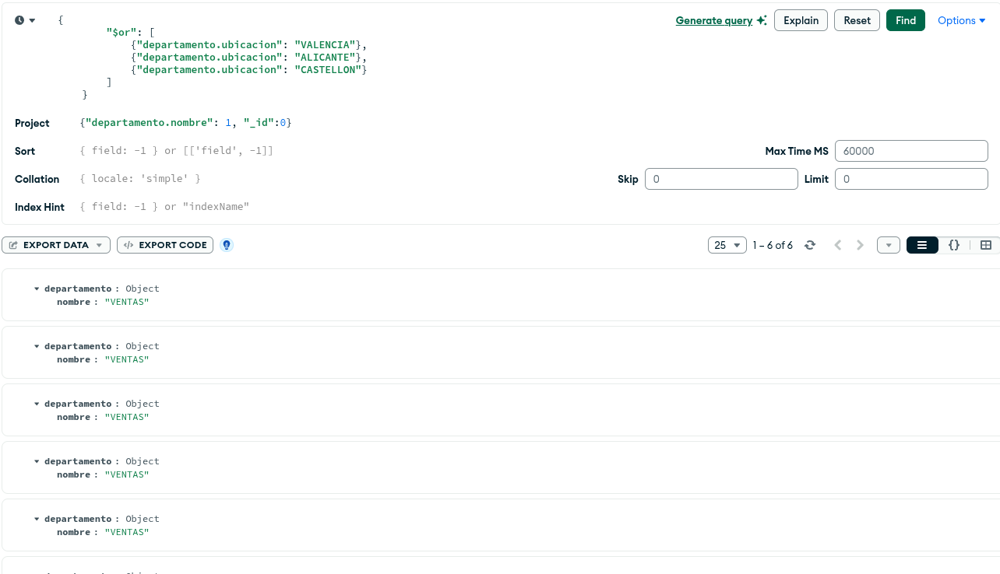
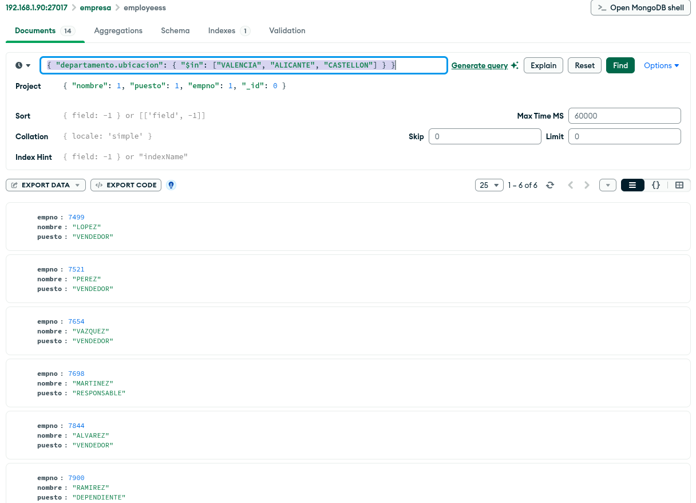
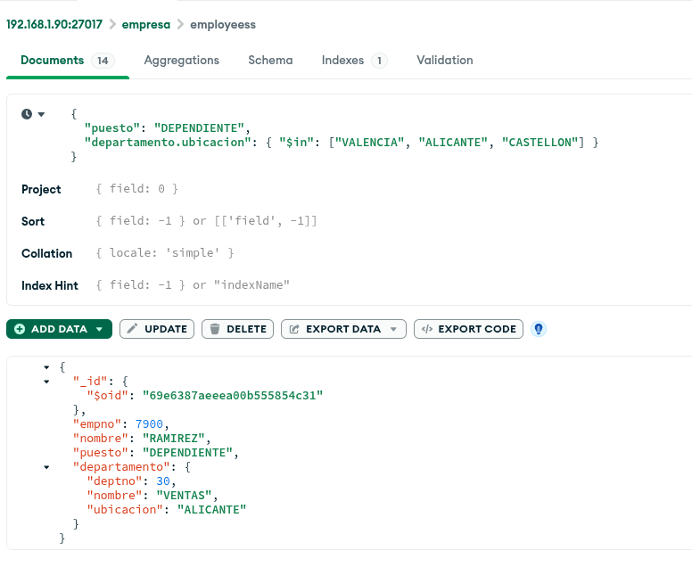

# UNIT 6 PART1: Activities

### 1. Obtain the departments located in the Valencian Community
    
```json
{
    "$or": [
        {"departamento.ubicacion": "VALENCIA"},
        {"departamento.ubicacion": "ALICANTE"},
        {"departamento.ubicacion": "CASTELLON"}
    ]
}
```

### 2. Show only the name of the previous departments, sorted by department name.


**Query**
    
```json
{
    "$or": {
        {"departamento.ubicacion": "VALENCIA"},
        {"departamento.ubicacion": "ALICANTE"},
        {"departamento.ubicacion": "CASTELLON"}
    }
}
```
    
**Project**
```json
    {
        "departamento.nombre": 1,
        "_id": 0
    }
```

<br/>

### 3. Show employees who work in the above departments.


**Query**
```json
{
    "$or": {
        {"departamento.ubicacion": "VALENCIA"},
        {"departamento.ubicacion": "ALICANTE"},
        {"departamento.ubicacion": "CASTELLON"}
    }
}
```
**Project**
```json
{ "nombre": 1, "puesto": 1, "empno": 1, "_id": 0 }
```


### 4. Show employees working as clerks in the previous departments.
```json
{ 
  "puesto": "DEPENDIENTE", 
  "departamento.ubicacion": { "$in": ["VALENCIA", "ALICANTE", "CASTELLON"] } 
}
```


<br/>

## MONGOSH
### 1. Obtain the departments located in the Valencian Community
```bash 
db.employeess.find({
    "departamento.ubicacion": { 
        "$in": ["VALENCIA", "ALICANTE", "CASTELLON"] 
    }
})
```
### 2. Show only the name of the previous departments, sorted by department name.
```bash
db.employeess.find({
  "departamento.ubicacion": {
  	"$in": ['VALENCIA', 'ALICANTE', 'CASTELLON']
  }
}).sort({"departamento.nombre": 1})
```

### 3. Show employees who work in the above departments.
```bash
db.employeess.find({
  "departamento.ubicacion": {
  	"$in": ['VALENCIA', 'ALICANTE', 'CASTELLON']
  }
}).sort({"departamento.nombre": 1})
```

### 4. Show employees working as clerks in the previous departments.
```bash 
db.employeess.find(
    {
        "puesto": "DEPENDIENTE", 
        "departamento.ubicacion": { 
            "$in": ["VALENCIA", "ALICANTE", "CASTELLON"] 
        }
    },
    {
        "nombre": 1, 
        "puesto": 1, 
        "empno": 1, 
        "_id": 0
    }
)
```